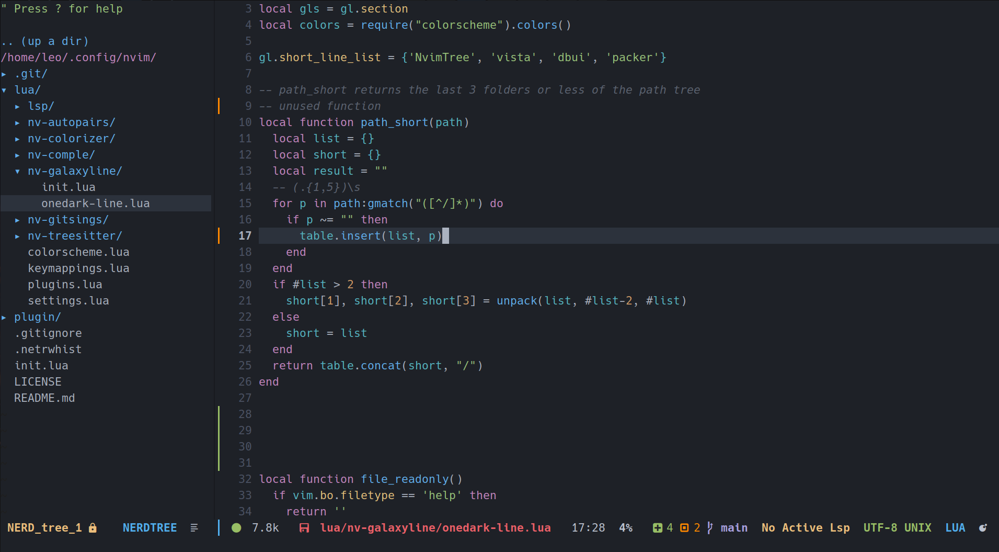
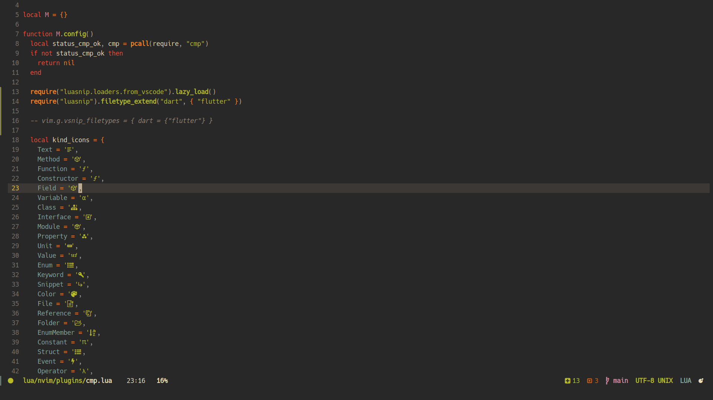

Neovim Lua Config
=================

New modular folder structure:

    ├── lua
    │   ├── nvim
    │   │   ├── colorscheme
    │   │   │   ├── init.lua
    │   │   │   ├── gruvbox.lua
    │   │   │   ├── onedark-night.lua
    │   │   │   └── ...
    │   │   ├── plugins
    │   │   │   ├── gitsigns.lua
    │   │   │   ├── lsp.lua
    │   │   │   ├── nvimtree.lua
    │   │   │   ├── packer.lua
    │   │   │   ├── treesitter.lua
    │   │   │   └── ...
    │   │   ├── init.lua
    │   │   ├── keymappings.lua
    │   │   └── settings.lua
    │   └── plugins.lua
    └── init.lua

## Plugin structure

Plugins have a base structure like this:

```lua
local M = {}

function M.config() -- Optional
  -- Make the config
end

function M.setup() -- Mandatory
  -- Set the config
end

return M
```

And all are loaders in the file `lua/nvim/init.lua`

## Colorscheme

In this folder you can define differents base colorschemes and colorthemes,
and define the default that will be used in the rest of the modules
(i.e. lualine, etc).

## Package Manager

I use [packer](https://github.com/wbthomason/packer.nvim), the plugin setting
is in the `lua/nvim/plugins/packer.lua`, but the plugin definitions are
in a diferent file `lua/plugins.lua`, in this way, I split the plugin
definitions and the plugin settings.

## Screenshots




[MIT License](./LICENSE)
